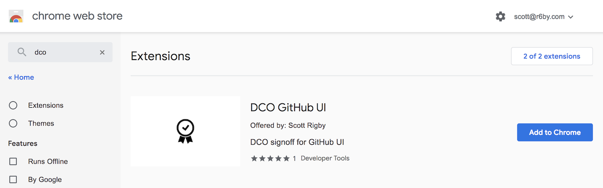
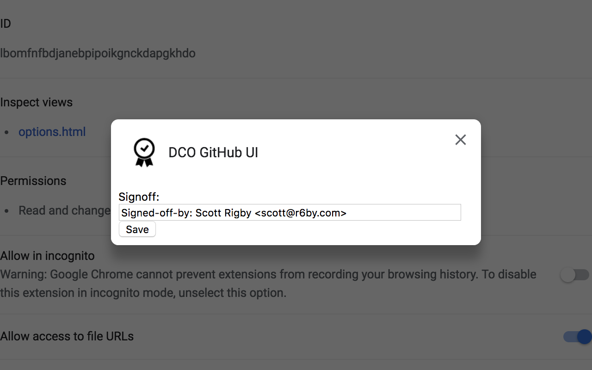
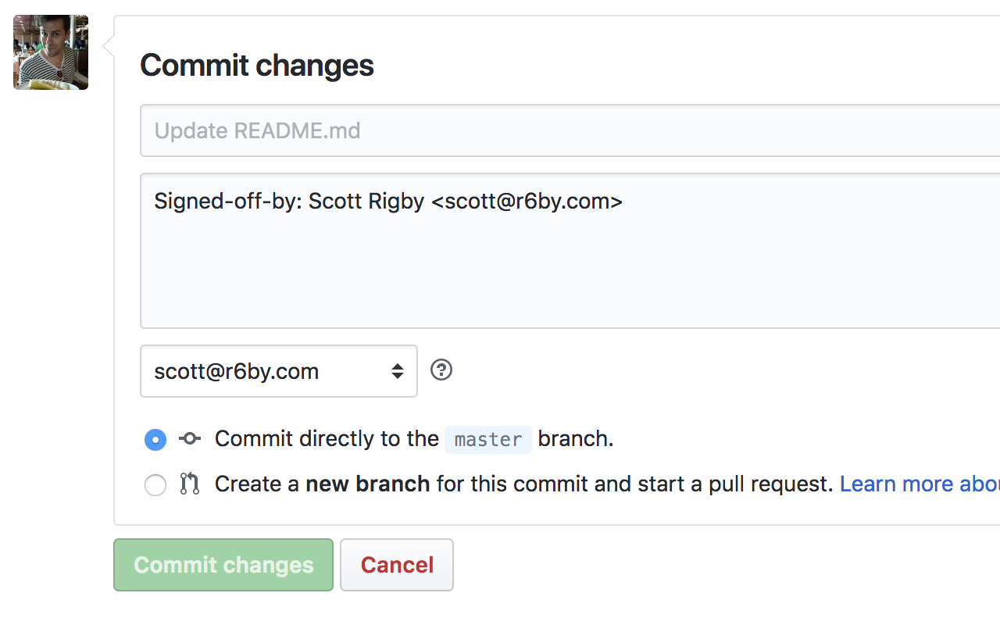

# DCO GitHub UI

This browser extension adds DCO Signed-off-by line to commits made with the GitHub browser UI.

## Install

### Chrome

In the Chrome web store [search for "dco"](https://chrome.google.com/webstore/search/dco), or go to [the extension page](https://chrome.google.com/webstore/detail/dco-github-ui/onhgmjhnaeipfgacbglaphlmllkpoijo), and click "Add to Chrome":



### Firefox

In Firefox Add-ons, [search for "dco"](https://addons.mozilla.org/en-US/firefox/search/?q=dco), or go to [the extension page](https://addons.mozilla.org/en-US/firefox/addon/scott-rigby/), and click "+ Add to Firefox":


## Configure

Add your full DCO signoff line in the extension options:



Your signoff should now prepopulate in the GitHub UI commit optional extended description textarea:



## What is DCO?

See `git help commit`:

```
-s, --signoff
    Add Signed-off-by line by the committer at the end of the commit log
    message. The meaning of a signoff depends on the project, but it typically
    certifies that committer has the rights to submit this work under the same
    license and agrees to a Developer Certificate of Origin (see
    http://developercertificate.org/ for more information).
```

## Related

For CLI git, see [this gist](https://gist.github.com/scottrigby/0c043c0bfbbdb5949e2d824fc3adeaa4).
